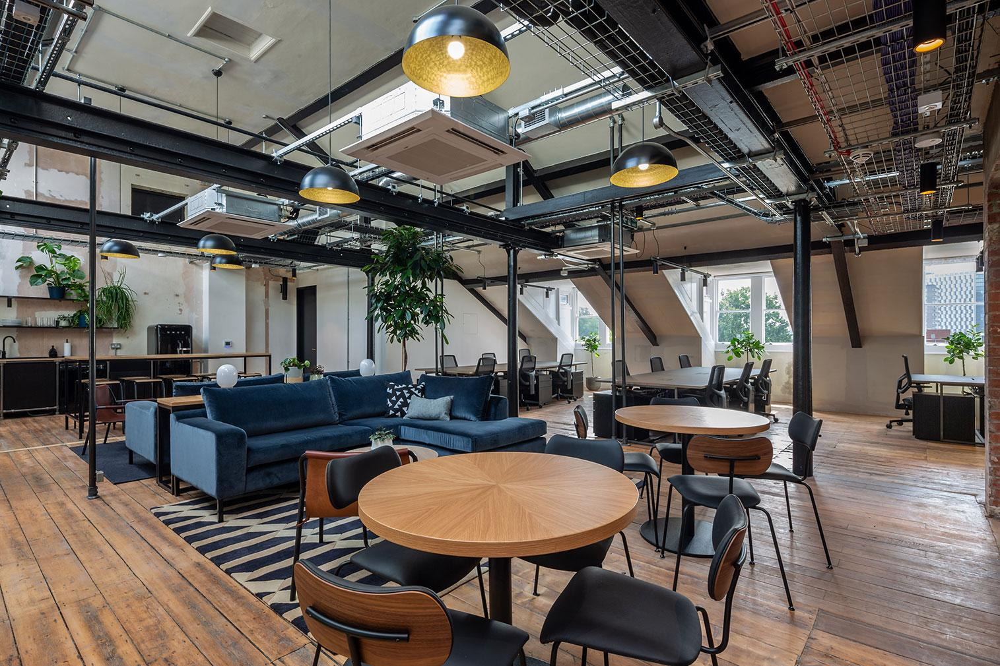
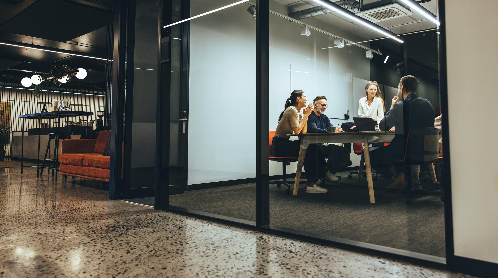
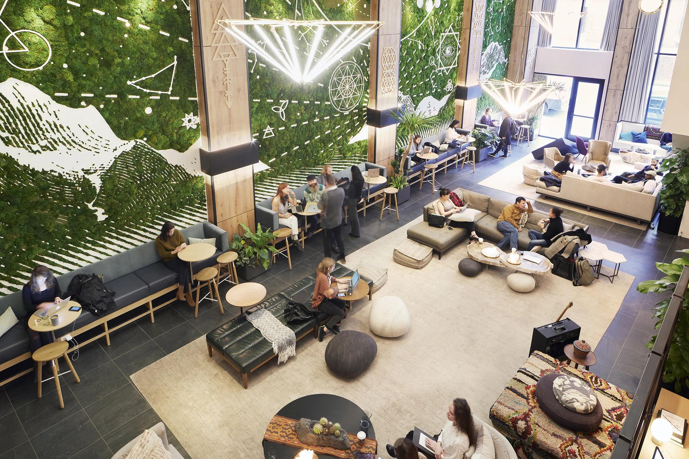
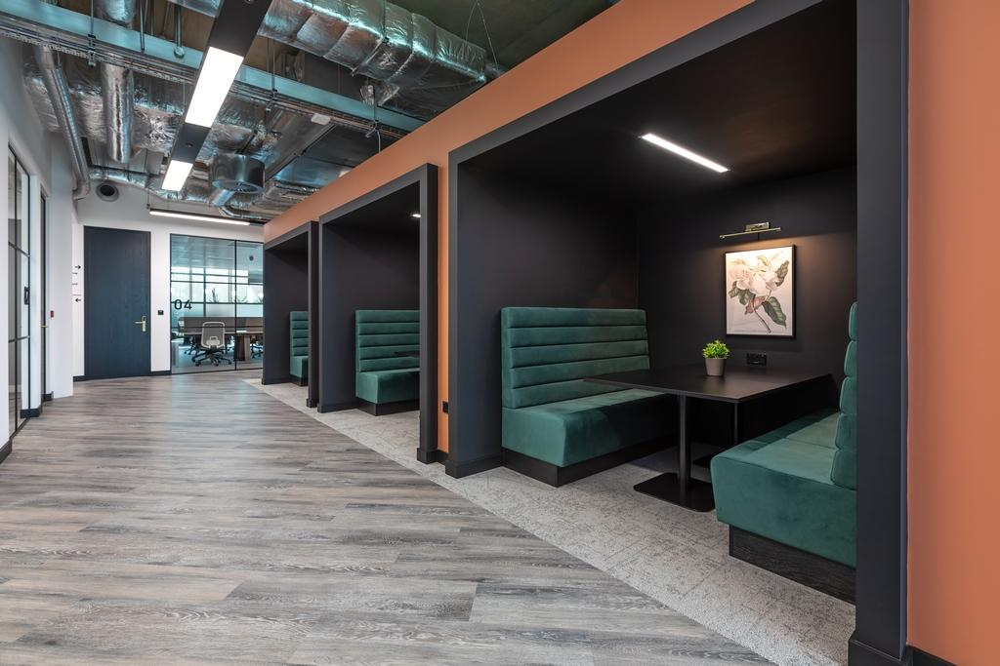

## Mumbles Cowork  
<code>Local Coworking Space — Mumbles, Wales</code>
<!-- _backgroundImage: linear-gradient(rgba(0,0,0,0.55), rgba(0,0,0,0.55)), url('3.jpg') -->
<!-- _backgroundSize: cover -->
<!-- _backgroundPosition: center -->

> A community coworking hub for remote workers, freelancers & hybrid professionals.

- **Venue Size:** 800–1,000 m²  
- **Operational Capacity:** **80–100 people (premium layout)**  
- **Pricing:** £100 / month • £20 / day  
- **Fixed Costs:** **£4,000 / month**  

---

## Space Preview  
<code>Bright, coastal interiors with flexible layout</code>

  
  
  
  

---

## Market Background & Use Case  

### UK Remote Work (Now Structural)
- **40–45%** remote or hybrid  
- **14–16%** fully remote  
- **26–30%** hybrid  
- Core sectors:
  - Tech • Finance • Design • Marketing • Consulting • Admin  

### Why Mumbles Works
- Middle-class, professional, residential
- High % home-owners & freelancers
- Commute friction to Swansea
- Demand from:
  - Remote staff, Parents, Contractors, Small founders

> Ideal demographic for coworking adoption.

---

## Business Model  

### Core Pricing
- **Monthly:** £100  
- **Day Pass:** £20  
- **Capacity:** **80–100 people**

### Fixed Monthly Costs
- **All-in fixed overhead:** **£4,000 / month**
  - Rent, Utilities, Internet, Cleaning, Insurance, Admin

### Extra Revenue
- Printing
- Snacks & drinks
- Meeting room hire
- Workshops / local events

---

## Returns — Conservative Base Case  

*(~40% utilisation of 80-person operational capacity)*

| Metric | Value | Notes |
|--------|-------|------|
| Members | 32 | 40% of 80 |
| Member Revenue | £3,200 | 32 × £100 |
| Daily Users | 5 / day | 20 days |
| Day Pass Revenue | £2,000 | |
| Extras Revenue | £400 | |
| **Total Revenue** | **£5,600** | |
| **Fixed Costs** | **−£4,000** | |
| **Net Monthly Profit** | **≈ £1,600** | |
| **Annual Profit** | **≈ £19,200** | |

> Break-even at **~25 members** or **~7 daily users/day**

---

## Returns — Strong Adoption Scenario  

*(~75% utilisation of 100-person capacity)*

| Metric | Value | Notes |
|--------|-------|------|
| Members | 75 | |
| Member Revenue | £7,500 | |
| Daily Users | 10 / day | 22 days |
| Day Pass Revenue | £4,400 | |
| Extras Revenue | £1,000 | |
| **Total Revenue** | **£12,900 / month** | |
| **Total Costs** | **−£4,000** | |
| **Net Monthly Profit** | **≈ £8,900** | |
| **Annual Profit** | **≈ £106,800** | |

---

## Why This Business Works  

- Remote work is **permanent**
- Mumbles has:
  - Income density
  - Professional population
  - Commute friction
- Revenue ceiling far exceeds fixed costs
- Multiple revenue streams
- Strong community effects
- Profitable at **low utilisation**
- Locally defensible once established

> *Numbers point to a scalable, high-yield local utility business.*

